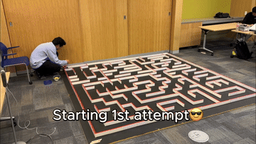
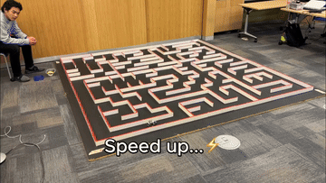
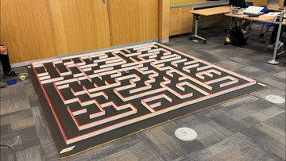
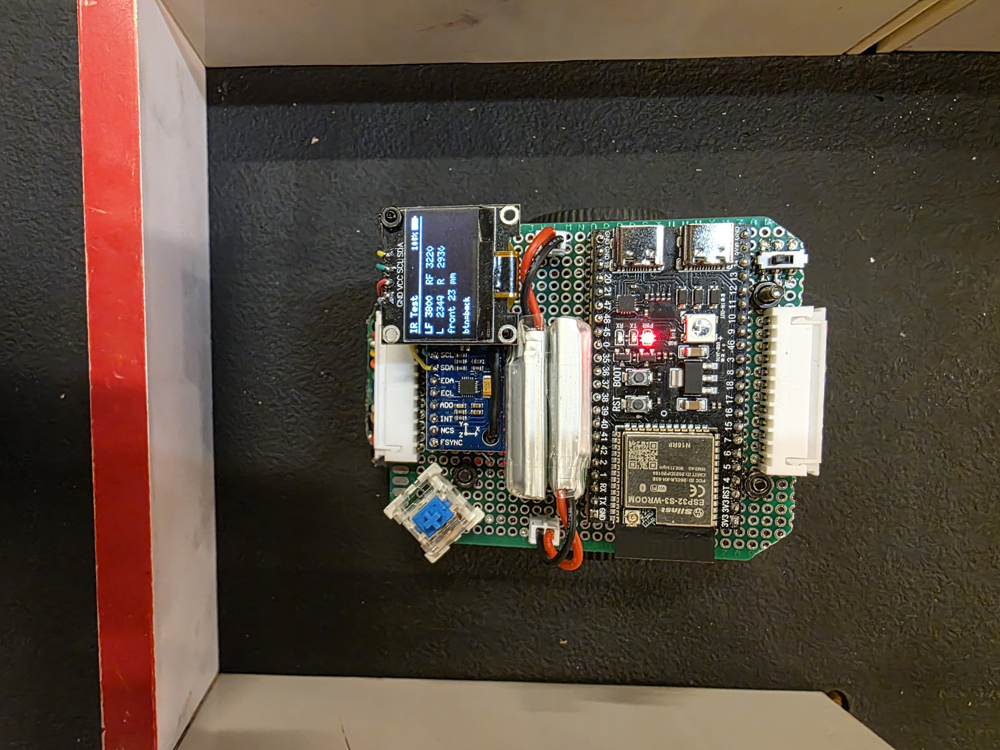
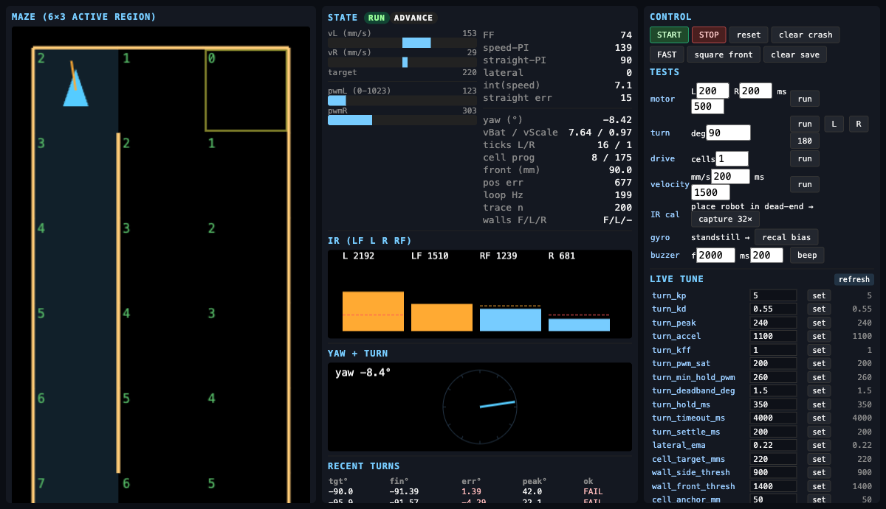
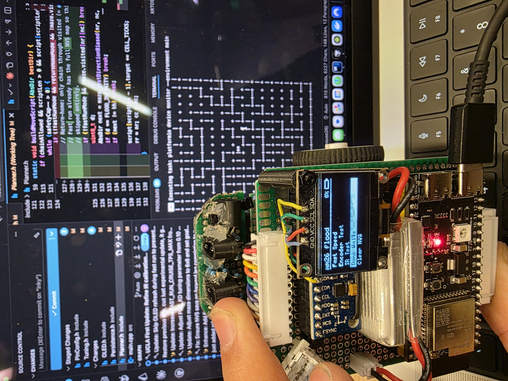
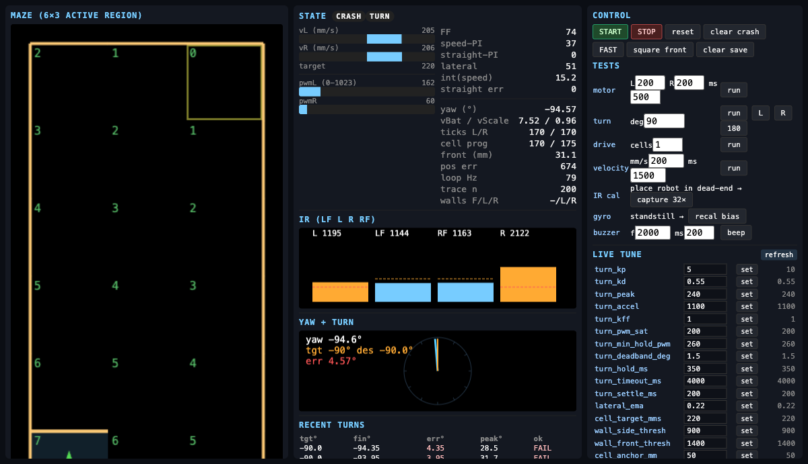

# NeuroMouse V2.0 — ESP32-S3 Micromouse Firmware

[](https://github.com/enkhbold470/neuromouse26/actions)
[](LICENSE)
[](https://platformio.org/)
[](#)

---

## 🎬 Competition Run Demos

[](https://www.youtube.com/watch?v=2M4ZANPrZ4s)

| 1. Explore Leg (Flood-Fill BFS) | 2. Fast Run (Straight-Chain Accel) | 3. Goal Reached & Celebration Spin |
|---|---|---|
|  |  |  |
| **Maze Mapping** — Flood-fill BFS exploring unexplored cells | **Fast Run** — Replaying optimal path with straight fusion | **Goal Reached** — 180° mechanical turn + RGB LED celebration |

---

## Hardware & Web Debugger Interface

| Hardware Setup | Live Web Debugger & Telemetry Dashboard |
|---|---|
|  |  |
| **V2.0 Competition Chassis** — proto-board, 2S LiPo, ESP32-S3-WROOM, MPU-6500, SSD1306 | **Web Debugger & Telemetry Dashboard** — 6×3 active region grid, live IR bar graphs, yaw compass |

<br>

| Bench Debugging | Live PID Tuning & Turn Error Analysis |
|---|---|
|  |  |
| **Dev Loop** — streaming flood-fill solver map while committing code | **Turn Telemetry & Live PID Tuning** — turn error logs, gyro bias tracking, online gain adjustment |

---

## Engineering Story & Lessons

### 1. The Pivot: Rapid Prototyping > Over-Engineering
- **Design V1.0:** A clean, custom PCB-based robot. While sleek and professional, the board layout became an iteration bottleneck. We couldn't modify sensor geometry or fix routing bugs fast enough.
- **Design V2.0 (The Winner):** Built entirely on a hand-soldered prototype board. What it lacked in aesthetics, it gained in 10x development speed — enabling rapid rewiring, instant sensor re-angling, and real-time hardware debugging.

### 2. Simulation vs. Reality
Our home test bench was a compact **6×3 sub-region grid** (visualized in our web telemetry interface above). Transitioning directly from home bench testing to the official **16×16 competition maze at IEEE UCLA** tested the limits of our firmware. The state machine, 16×16 flood-fill (BFS) solver, and position-PID motion control scaled seamlessly under competition pressure.

### 3. Web Telemetry & Online PID Tuning Dashboard
To debug motion PID and IR thresholds without repeatedly re-flashing firmware, we developed a real-time web control dashboard (`WifiDebug.h`):
- **Live 6×3 Grid Pose:** Renders real-time robot cell position, heading triangle, and flood distances.
- **Dynamic IR Visualizer:** Real-time 4-channel bar charts (L, LF, RF, R) with overlaid threshold lines (`WALL_SIDE_THRESH`, `WALL_FRONT_THRESH`).
- **Yaw & Turn Compass:** Visual compass tracking desired vs. actual yaw deg with peak overshoot & error logging.
- **Online Parameter Tuning:** Modify `turn_kp`, `turn_kd`, `turn_accel`, `cell_target_mms`, and `wall_side_thresh` on the fly over HTTP.

### 4. Bootstrap Engineering
Built entirely on a budget using accessible off-the-shelf components from AliExpress, paired with Amazon overnight deliveries when parts broke during crunch hours.

---

## What Makes This Novel

| Feature | Detail |
|---|---|
| **Single-TU Firmware** | All headers text-included into one `main.cpp` — zero link-time ambiguity, instant build iteration |
| **PCNT 4× Quadrature** | ESP32-S3 hardware PCNT peripheral gives true 4× decode at zero CPU cost — no ISR jitter |
| **Phase-Script Motion** | Each move is a `PhaseStep[]` list: `PH_FORWARD` → trapezoidal position-PID, `PH_SPOT` → IMU-yaw-PID |
| **Fast-Run Straight Fusion** | `buildMoveScript` chains consecutive straight cells into one `PH_FORWARD` — trapezoid ramps over the whole corridor without per-cell braking |
| **Front-Distance LUT** | `IRCalibration.h` interpolates LF+RF through a per-cm lookup table — wall-relative cell anchoring at ±2 mm |
| **NVS-Persisted Maze** | Explored walls survive power cycles via ESP32 NVS memory; fast-run reuses the flood-fill map directly |
| **Tactile Blue Switch UI** | Mechanical linear blue switch + 0.96" OLED menu system for mode selection and live diagnostic streaming |

---

## Hardware Stack

```
MCU:            ESP32-S3-WROOM (Xtensa LX7 dual-core, 240 MHz)
Motors:         GA-N20 brushed DC — 1:30 gear ratio, 500 RPM @ 6V
Driver:         DRV8833 dual H-bridge (one channel per side)
Encoders:       7 CPR magnetic quadrature disk on motor shaft (PCNT 4× decode)
IR Emitters:    SFH4545 (950 nm narrow-angle IR LEDs)
IR Receivers:   TEFT4300 (NPN phototransistors)
                - LF/RF → straight forward (front detect + align)
                - L/R   → 90° perpendicular (true side-wall reads)
Gyro/IMU:       MPU-6500 (SPI) — yaw integration for spot turns
Display:        0.96" SSD1306 128×64 OLED (I2C)
Tactile Switch: Linear Tactile Blue Keycap Switch (GPIO 42)
Battery:        300 mAh 2S LiPo (7.4V nominal)
```

**Key Measured Constants** (chassis-specific — re-measure if wheels/tires change; values below match current `Tuning.h` / `PinConfig.h`):

| Constant | Value | Notes |
|---|---|---|
| `CELL_TICKS` | 1373 | Hand-measured per cell pitch. Do NOT derive from CPR |
| `RIGHT_ENC_SCALE` | 1.0028f | Left/right encoder mechanical balance factor |
| `MOTOR_PWM_FREQ_HZ` | 200 Hz | Optimal stiction-breaking torque on DRV8833 + N20 |
| `WHEEL_DIAMETER` | 33.4 mm | |
| `WHEEL_TRACK_MM` | 80 mm | |

---

## Firmware Architecture

Newcomers: start at [`src/main.cpp`](src/main.cpp) (top comment + `setup`/`loop`), then [`include/README.md`](include/README.md), then `Tuning.h` / `PinConfig.h`.

```
src/
  main.cpp                  Hardware instances, PID, setup() + loop() state machine
include/
  README.md                 Header map, include order, LEGACY/dormant notes
  Tuning.h                  Every tuning constant — sections [A]–[H]
  PinConfig.h               All GPIO assignments + PWM/IR caps (+ LEGACY test knobs)
  IMU.h                     MPU-6500 register stack, bias capture, yaw integration
  IRSensors.h               4-sensor IR, ambient-subtracted reads, EMA smoothing
  IRCalibration.h           Per-cm LUT + estimateFrontDistMM()
  MotionScript.h            PhaseStep[] data + script push helpers
  Planner.h                 setupMaze, senseAndStoreWalls, buildMoveScript
  MicromouseMaze.h          16×16 flood-fill BFS + bestDirectionBiased()
  MicromouseMotor.h         DRV8833 LEDC wrapper (drive / brake / coast)
  MicromouseEncoderPCNT.h   ESP32-S3 PCNT 4× quadrature decoder
  OLED.h                    SSD1306 menu, run, and diagnostics screens
  Persistence.h             NVS save/load (walls + fast-run speed)
  BLECarControl.h           Optional BLE RC mode (OLED menu)
  WifiDebug.h               DORMANT HTTP debugger (not in env:main)
  Battery.h                 Vbat ADC → 0–100% SOC
  Pose.h                    Robot pose + mode flags
test/
  *.cpp                     Standalone test sketches (one env each in platformio.ini)
```

### State Machine (`loop()`)

```
IDLE → [button] → EXPLORE_THINK → RUN → GOAL
                                    ↓
                                  CRASH (flood-fill target unreachable)
IDLE → BLE_CAR_DRIVE (optional RC) → IDLE
```

**RUN** executes the current `PhaseStep`:

- **`PH_FORWARD`** — trapezoidal velocity profile, position-PID closure, IR lateral centering + yaw hold
- **`PH_SPOT`** — IMU yaw-PID in-place turn (both wheels opposite)
- **`PH_ALIGN_FRONT`** — slow creep to IR-calibrated front-wall gap (dead-end exit)
---

## Quickstart

### Prerequisites

- [PlatformIO](https://platformio.org/) (VS Code extension or CLI)
- ESP32-S3-WROOM connected via USB-CDC

### Build & Upload

```bash
pio run -e main               # build
pio run -e main -t upload     # build + upload
pio device monitor            # serial monitor @ 115200 baud
```

### First Run

1. Power on → OLED displays main menu
2. Blue keycap switch selects mode; encoder wheel adjusts Fast Run Speed
3. **Explore Mode** — maps the maze using flood-fill BFS; saves walls to NVS
4. **Fast Run Mode** — executes the optimal path at `fastRunCruiseTps` (menu-adjustable, NVS-persisted)

---

## Test Sketches

Each `test/*.cpp` has a corresponding environment in `platformio.ini`:

```bash
pio run -e ir-test      -t upload    # 4-channel IR diagnostics + front-distance
pio run -e encoder-test -t upload    # PCNT tick count + RPM
pio run -e mpu6500      -t upload    # gyro bias capture + yaw stream
pio run -e ws2812b      -t upload    # WS2812B status LED validation
```

---

## Team & Acknowledgments

**Inky Ganbold · Yu Hong (Elijah) Chen · Enzo Emami**  
*UCLA IEEE All America Micromouse Contest 2026 (AAMC)*

Special thanks to AliExpress for affordable base hardware, Amazon for overnight parts delivery, and IEEE Student Branch at UCLA for hosting a great competition.

---

## License

[MIT License](LICENSE) — Copyright (c) 2026 Inky Ganbold, Yu Hong (Elijah) Chen, Enzo Emami.

## Contributing

See [CONTRIBUTING.md](CONTRIBUTING.md).
Key conventions: all pins in `PinConfig.h`, all tuning in `Tuning.h`, no FreeRTOS task splits, LEDC is Arduino 2.x API (`ledcSetup` + `ledcAttachPin`).
