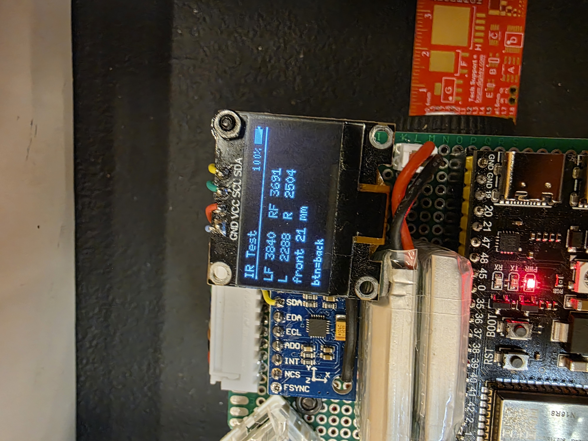
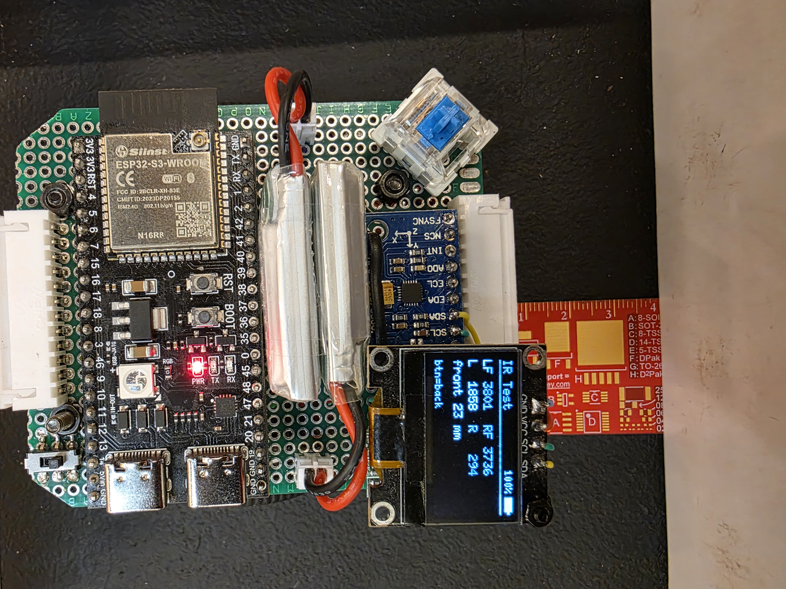
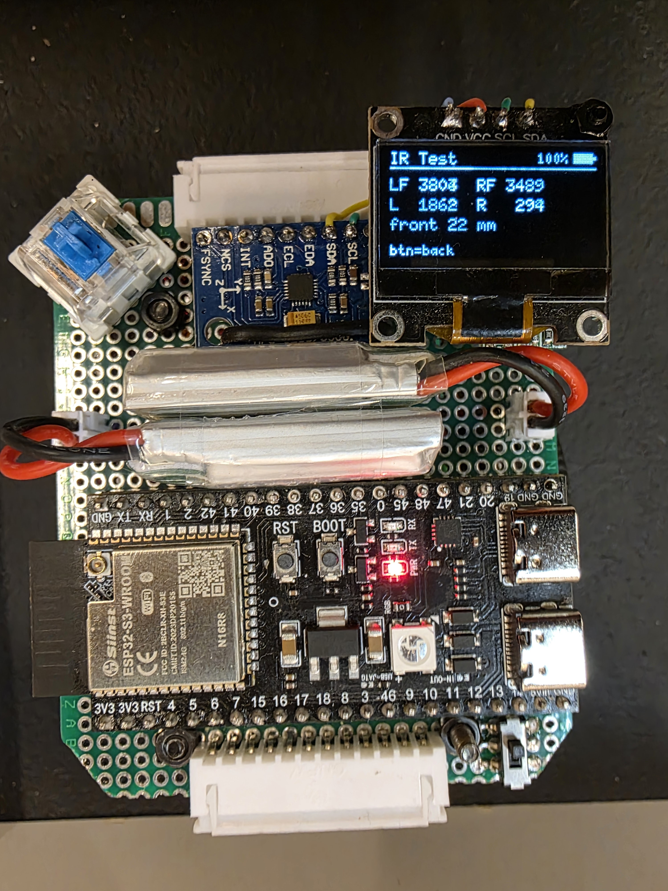
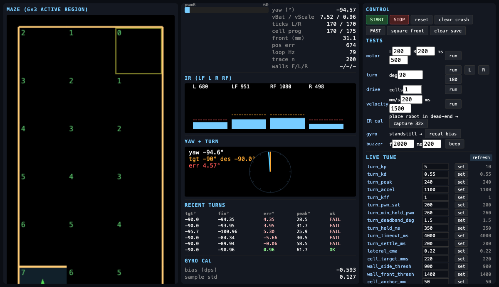

# NeuroMouse V2.0 — ESP32-S3 Micromouse

**3rd Place Overall · All America Micromouse Contest (AAMC) 2026 · UCLA IEEE**

[](https://github.com/enkhbold470/neuromouse26/actions)
[](LICENSE)
[](https://platformio.org/)
[](#)

[](https://www.youtube.com/watch?v=2M4ZANPrZ4s)

---

## Competition runs

| Explore (flood-fill BFS) | Fast run (straight-chain accel) | Goal + celebration spin |
|---|---|---|
|  |  |  |

---

## The mouse

| In the maze | Internals + OLED IR test | Blue switch + 2S LiPo |
|---|---|---|
|  |  |  |

| ESP32-S3 + MPU-6500 + OLED | Late-night debug loop |
|---|---|
|  |  |

---

## Live web debugger

| Run state | Turn telemetry | Full telemetry + live PID |
|---|---|---|
|  |  |  |

---

## Why this exists

Two months after AAMC, the firmware is open source.

Most open-source micromice are STM32. Not many use ESP32 — it is still a relatively new board for this contest. NeuroMouse is an ESP32-S3 stack that actually placed: flood-fill, position-PID, and a protoboard chassis that we could rewire in minutes.

The win is not the interesting part. The engineering process is.

### The pivot: rapid prototyping > complexity

We actually built two mice.

- **Design V1.0** — a clean, custom-PCB robot. It looked professional. It was also a bottleneck. A wrong resistor, a noisy power rail, or a sensor sitting too close to a wheel meant another board spin — about a week we did not have.
- **Design V2.0 (the one that placed)** — built entirely on a prototype board. It was not pretty. Point-to-point solder, jumper wire, a linear blue keyswitch hanging off the corner. The ability to desolder, move a sensor, and re-test in fifteen minutes is what got us on the podium.

Pretty never ships. Iteration does.

### Simulation vs. reality

Our practice maze at home was a tiny **6×3** grid of dollar-store foam board. The official maze at IEEE UCLA is **16×16** — 256 cells.

On 6×3 you can be a few millimeters off and still look fine. On 16×16 those millimeters accumulate. One bad IR read and you drive into a wall thirty cells later. Dropping the mouse into that maze forced the C++ flood-fill solver and position-PID motion control to scale instantly, under a clock, in a maze we had never seen.

### Bootstrap engineering

Low budget, off-the-shelf parts. AliExpress for the base hardware. Amazon overnight when something broke the night before a run. The 0.96" I2C OLED was the best hardware decision on the robot — maze map, IR values, PID, battery, on the mouse, with no laptop. At AAMC you get about five minutes between runs. Plug in, read the screen, go again.

---

## The stack

| | |
|---|---|
| **MCU** | ESP32-S3-WROOM (Xtensa LX7 dual-core, 240 MHz) · PlatformIO · Arduino 2.x |
| **Screen** | 0.96" I2C OLED (SSD1306) — it was a banger |
| **Sensors** | SFH4545 emitters + TEFT4300 phototransistors (LF / L / R / RF) |
| **Gyro** | MPU-6500 (I2C `0x68`, shared bus with the OLED) |
| **Motors** | GA-N20, 1:30, 500 RPM @ 6 V (7 CPR encoder) |
| **Driver** | DRV8833 dual H-bridge |
| **Control** | Position-PID, IMU yaw-hold, flood-fill BFS |
| **Battery** | 300 mAh 2S LiPo |
| **Button** | Linear tactile blue switch |

Chassis-specific constants (re-measure if wheels or tires change): `CELL_TICKS = 1400` per 180 mm cell · `RIGHT_ENC_SCALE = 1.0135f` · `MOTOR_PWM_FREQ_HZ = 200`.

---

## Firmware (short)

Single translation unit: `src/main.cpp` text-includes every header. No link-time surprises. The RUN loop is paced with `micros()` — no `delay()` in the control path.

```
IDLE → Explore / Fast Run → EXPLORE_THINK → RUN → GOAL
                                              ↓
                                            CRASH
```

- **`PH_FORWARD`** — trapezoidal velocity profile, position-PID, IR centering + yaw hold
- **`PH_SPOT`** — IMU yaw-PID in-place turn
- **`PH_ALIGN_FRONT`** — creep to a calibrated front-wall gap (dead-end exit)
- Fast run fuses consecutive straight cells into one `PH_FORWARD` so the trapezoid stretches over the whole corridor instead of braking every cell
- Explored walls persist in ESP32 NVS (`mm26` / `walls`) so Fast Run can skip sensing

```
src/main.cpp                 instances, PID, setup() + loop()
include/Tuning.h             every knob — sections [A]–[H]
include/PinConfig.h          every GPIO
include/Planner.h            sense walls, buildMoveScript, straight fusion
include/MicromouseMaze.h     16×16 flood-fill BFS
include/MicromouseEncoderPCNT.h   ESP32-S3 PCNT 4× decode
include/WifiDebug.h          live HTTP telemetry (side env, not main)
```

---

## Quickstart

```bash
pio run -e main               # build
pio run -e main -t upload     # flash
pio device monitor            # 115200 baud
```

Power on → OLED menu. Blue switch selects mode. Encoder knob sets Fast Run cruise.

| Env | What it tests |
|---|---|
| `pio run -e ir-test -t upload` | 4-channel IR + front-distance LUT |
| `pio run -e encoder-test -t upload` | PCNT ticks + RPM |
| `pio run -e mpu6500 -t upload` | gyro bias + yaw stream |
| `pio run -e ws2812b -t upload` | status LED |

Set `TELEMETRY = false` in `include/Tuning.h` before a competition run. Serial prints will stall the ~199 Hz PID loop.

---

## Team

**Enkhbold Ganbold · Yu Hong (Elijah) Chen**

Huge thanks to Elijah for the grind, to [IEEE Student Branch at UCLA](https://projects.ieeebruins.com/micromouse/aamc) for putting on AAMC, and to Green Ye ([greenye.net](https://greenye.net), [MicromouseUSA.com](https://micromouseusa.com)) for keeping the knowledge base alive.

[Original AAMC write-up (LinkedIn)](https://www.linkedin.com/posts/enkhbold470_micromouse-robotics-computerscience-activity-7465158914070974464-ApCQ) · [Longer story (Medium)](https://enkhy.medium.com/we-placed-3rd-at-the-all-america-micromouse-contest-heres-what-actually-mattered-a360fe9695d1) · [Competition run (YouTube)](https://www.youtube.com/watch?v=2M4ZANPrZ4s)

## License

[MIT](LICENSE) — Copyright (c) 2026 Enkhbold Ganbold, Yu Hong (Elijah) Chen.

See [CONTRIBUTING.md](CONTRIBUTING.md). Pins live in `PinConfig.h`. Tuning lives in `Tuning.h`. LEDC is Arduino 2.x (`ledcSetup` + `ledcAttachPin`).
